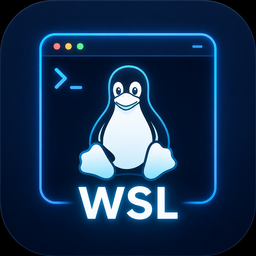

# wslView

Aplicativo desktop leve em Python para gerenciar distribuições WSL no Windows.

## Requisitos

- Windows 10/11 com WSL instalado
- Python 3.11+
- [CustomTkinter](https://github.com/TomSchimansky/CustomTkinter) para a
  interface (única dependência externa do projeto — desvio deliberado da
  ideia original de usar só a stdlib, em troca de um visual mais moderno)

## Instalação e execução

```bash
git clone https://github.com/thaus03/wslView.git
cd wslView
pip install -r requirements.txt
python main.py
```

## Funcionalidades

- Listar todas as distros WSL instaladas com status (Running/Stopped)
- Iniciar uma distro selecionada
- Parar uma distro selecionada
- Encerrar todas as distros de uma vez ("Shutdown All")
- Exibir o tamanho do arquivo VHDX de cada distro WSL2 (lido via registro do Windows)
- Atualização de status via botão "Refresh" (sem polling automático)

## Gerando o executável (.exe)

Um `.exe` pronto é gerado automaticamente a cada push/PR pela CI — veja o
artifact `wslView-windows` na aba [Actions](https://github.com/thaus03/wslView/actions).
Para compilar localmente, o passo a passo está na
[Wiki](https://github.com/thaus03/wslView/wiki/Gerando-o-executavel).

## Contributors

<!-- ALL-CONTRIBUTORS-LIST:START - Do not remove or modify this section -->
<!-- prettier-ignore-start -->
<!-- markdownlint-disable -->
<table>
  <tbody>
    <tr>
      <td align="center" valign="top" width="14.28%"><a href="https://github.com/thaus03"><br /><sub><b>Igor Carvalho</b></sub></a><br /><a href="#code-thaus03" title="Code">💻</a> <a href="#doc-thaus03" title="Documentation">📖</a> <a href="#infra-thaus03" title="Infrastructure">🚇</a> <a href="#ideas-thaus03" title="Ideas, Planning, & Feedback">🤔</a> <a href="#projectManagement-thaus03" title="Project Management">📆</a></td>
      <td align="center" valign="top" width="14.28%"><a href="https://github.com/anthropics/claude-code"><br /><sub><b>Claude Code</b></sub></a><br /><a href="#code-claude-code" title="Code">💻</a> <a href="#doc-claude-code" title="Documentation">📖</a> <a href="#infra-claude-code" title="Infrastructure">🚇</a></td>
      <td align="center" valign="top" width="14.28%"><a href="https://github.com/NousResearch/hermes-agent"><br /><sub><b>Hermes Agent</b></sub></a><br /><a href="#ideas-NousResearch" title="Ideas, Planning, & Feedback">🤔</a> <a href="#infra-NousResearch" title="Infrastructure">🚇</a> <a href="#code-NousResearch" title="Code">💻</a> <a href="#doc-NousResearch" title="Documentation">📖</a></td>
    </tr>
  </tbody>
</table>
<!-- markdownlint-restore -->
<!-- prettier-ignore-end -->
<!-- ALL-CONTRIBUTORS-LIST:END -->

## Changelog

Veja as [Releases do GitHub](https://github.com/thaus03/wslView/releases) para o changelog detalhado de cada versão.
